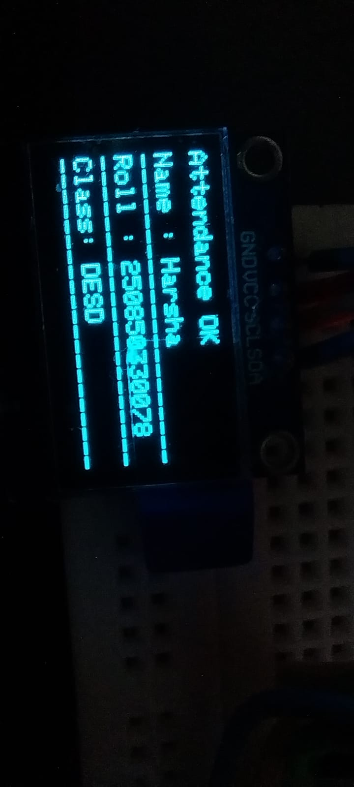

# 📡 Cloud-Based RFID Attendance System

A cloud-connected, automated RFID attendance system using **ESP32, MQTT, Raspberry Pi, and Google Sheets** for real-time attendance tracking with high reliability and low human error.

---

## 📌 Project Overview

Traditional attendance systems are:
- ⏱️ Time-consuming  
- ❌ Prone to human errors  
- 📄 Difficult to manage and analyze  

This project implements a **Cloud-Based RFID Attendance System** that automates attendance logging with real-time cloud synchronization using **MQTT and HTTP**.

---

## 🎯 Project Objectives

- Automate student attendance using RFID  
- Store attendance **locally and on the cloud**  
- Enable **real-time data synchronization**  
- Reduce human errors  
- Provide **administrator configuration features**  

---

## 🧰 Hardware Components

- ESP32  
- RFID Reader (MFRC522)  
- Raspberry Pi  
- OLED Display  
- LEDs & Buzzer  
- Wi-Fi Network  

---

## 💻 Software & Technologies Used

- Arduino IDE  
- Embedded C  
- Mosquitto MQTT Broker  
- Google Apps Script  
- Google Sheets  
- HTTP Protocol  

---

## 🧱 System Architecture

### 🔹 Block Diagram

```text
ESP32 (RFID Reader)
        |
        | MQTT (Publish)
        v
Mosquitto MQTT Broker
        |
        | MQTT (Subscribe)
        v
Raspberry Pi
        |
        | HTTP
        v
Google Apps Script
        |
        v
Google Sheets (Cloud Database)
```
## 🧱 System Architecture

### 🔹 Block Diagram


---

### 🔹 Circuit Diagram


---

## ⚙️ Working Principle

1. Student scans the RFID card  
2. ESP32 reads the RFID UID  
3. UID is published to the MQTT broker  
4. Raspberry Pi subscribes and receives the UID  
5. Attendance is stored in the local database  
6. Data is sent to Google Sheets using HTTP  
7. OLED display and LEDs provide user feedback  

---

## 🔄 Operating Modes

### 👨‍🎓 Student Mode (Default)

- Students scan RFID cards  
- Attendance is marked automatically  
- OLED displays attendance status  
- LEDs indicate success or failure  

### 👨‍💻 Administrator Mode

- Access Point (AP) configuration mode  
- Change Wi-Fi credentials  
- Manage student records  
- View system logs and system status  

---

## 🗄️ Database & Cloud Features

### 📍 Local Database

- Stores attendance during internet failure  
- Prevents data loss  

### ☁️ Cloud Integration

- Google Sheets used as cloud database  
- Time-stamped attendance logs  
- Automatic cloud synchronization  

### 🛠️ Admin Control Panel

- Dynamic Wi-Fi configuration  
- Student record management  
- Backup & restore support  

---

## 📊 Results & Performance

- ⏱️ **RFID Scan Time:** < 5 seconds  
- 📈 **System Uptime:** 99%  
- 🔁 Real-time cloud synchronization  
- 💡 OLED and LED visual feedback  

---

## 🌍 Real-World Applications

- Educational Institutions  
- Training Centers  
- Corporate Offices  
- Residential Hostels  

---

## 🚀 Future Scope

- Biometric authentication integration  
- Mobile application for teachers & parents  
- SMS & Email alert system  
- Advanced analytics dashboard  
- Multi-device connectivity  

---

## 👥 Team Members

**Group – 24**

- Velagala Jayakanth Reddy (250850330076)  
- Vinnakota Srinivas (250850330077)  
- Yakkala Harsha Vardhana Raju (250850330078)  

---

## 📸 Project Demo Images

  
  
  

---

## 📜 Conclusion

This project successfully demonstrates a **secure, scalable, and real-time RFID attendance system** using MQTT and cloud technologies.  
The dual-database approach ensures data reliability, while admin controls enable easy system configuration and management.

---

⭐ If you like this project, don’t forget to **star ⭐ the repository!**
